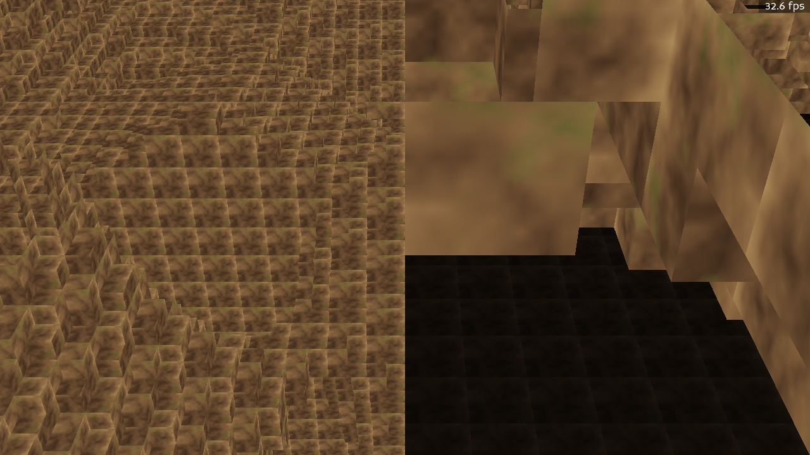

# Torn Apart

A fantasy post-apocalyptic sandbox RPG built on a custom, numpy-first engine that uses
**Panda3D as a rendering SDK only**. You fly over hard-edged voxel terrain with procedural
textures and baked sunlight, blow craters in it, and save/load the world as compact deltas.

This repo is the **Session 1 vertical slice**: a deterministic, explorable procedural voxel
world with brush-based terrain editing and delta saves. The simulation layers (AI, economy,
politics, buildings) are stubs for now — see [docs/ARCHITECTURE.md](docs/ARCHITECTURE.md).



*Spawn view: hard-edged voxel terrain textured with the procedural `wasteland_ground` material,
lit by a CPU sunlight pass baked into vertex colours (note the lit tops and shadowed undersides).*

## Setup

Python 3.11+ required.

```bash
python -m venv .venv
.venv\Scripts\activate            # Windows  (use: source .venv/bin/activate on POSIX)
pip install -r requirements.txt
```

## Run

```bash
python main.py
```

### Controls

| Input | Action |
|---|---|
| `W` `A` `S` `D` | Move (horizontal, relative to facing) |
| `Space` / `Ctrl` (or `E` / `Q`) | Move up / down (world Z) |
| `Shift` | Sprint (5× move speed) |
| Mouse move | Look around (yaw + pitch) when the mouse is captured |
| `ESC` | Toggle mouse capture |
| **Left-click** | **Fire an explosion** — raycasts the voxel field and carves a `SphereBrush(REMOVE)` crater |
| **F5** | **Quick save** to `saves/quick.ta` (delta = edited chunks only) |
| **F9** | **Quick load** — reverts all edits to baseline, then re-applies the saved craters |

The crater appears and relights within a frame or two: the brush marks chunks dirty + edited and
publishes a `TerrainEditedEvent`; the sunlight computer (subscribed to the bus) recomputes the
affected light column; the next streaming pass remeshes those chunks with fresh baked light.

## Testing

```bash
pytest -q                 # full headless suite (no window / GPU): 257 passed, 1 deselected
pytest -m window          # the one GPU-required test: the real-.egg ResourceManager loader
```

The headless suite runs without a window because **only `world/` and `lighting/` may import
panda3d** — every other package is pure Python/numpy and fully testable headless.

### Offscreen tools (no window needed)

```bash
python tools/preview_texture.py wasteland_ground   # render a ProceduralTextureDef → tools/out/<name>.png
python tools/screenshot.py --out spawn.png         # offscreen-buffer screenshot of the spawn view
python tools/screenshot.py --explode               # carve a crater first (the light-shaft "money shot")
python tools/dump_save.py saves/quick.ta           # inspect a save file's header + per-system deltas
```

## Architecture at a glance

The engine is layered; downward calls are direct, upward/sideways notifications go through the
Event Bus. The full design authority is [docs/ARCHITECTURE.md](docs/ARCHITECTURE.md).

```
Player ──► World ──► Terrain ──► Lighting / Resources ──► Procedural / Core / Save
            (sole render caller; Lighting is the one GPU-upload exception)
```

- **`docs/` is grep-first** — it is the AI search index. Before exploring code, grep `docs/`:
  every `docs/systems/<package>.md` documents exactly one package (filename == package name) using
  an identical set of H2 headings (Role / Public API / Imports Allowed / Events / Units & Invariants
  / Examples / Gotchas), so structured queries work. Start at
  [`docs/systems/`](docs/systems/) and the `keywords:` line atop each doc.
- **The layer / import rule:** only `world/` and `lighting/` may import `panda3d`. Everything else
  stays engine-agnostic so the simulation is headless-testable. The bridges
  (`world/texture_bridge.py`, `world/geometry_bridge.py`, `world/resource_adapter.py`) are the
  panda3d boundary.
- **Determinism:** the entire world is a pure function of `world_seed` (set in
  [`config.toml`](config.toml)). The same seed always produces byte-identical terrain and textures
  — that is what makes delta saves and reproducible bug repro possible. All randomness flows through
  `core.rng.for_domain(*keys)` (never `random.*`, never unseeded `np.random.*`).

## Repo layout

```
main.py            # vertical-slice demo entry point
config.toml        # world_seed + sizes/distances (no magic numbers in code)
torn_apart/        # the engine package (core, world, player, procedural, resources,
                   #   terrain, lighting, save; buildings/ai/economy/politics are stubs)
docs/              # grep-first knowledge base (ARCHITECTURE, DEVELOPMENT_PLAN, systems/, sessions/)
tests/             # headless suite (+ one @pytest.mark.window test)
tools/             # preview_texture.py, screenshot.py, dump_save.py
assets/            # hand-crafted only (env textures are procedural — never here)
saves/             # gitignored
```

See [DECISIONS.md](DECISIONS.md) for the dated decision log and
[docs/sessions/session-01.md](docs/sessions/session-01.md) for the Session 1 handoff note.
