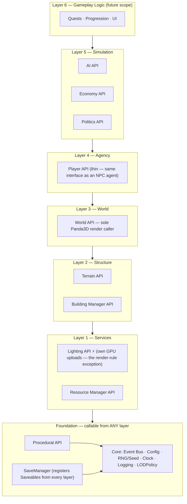
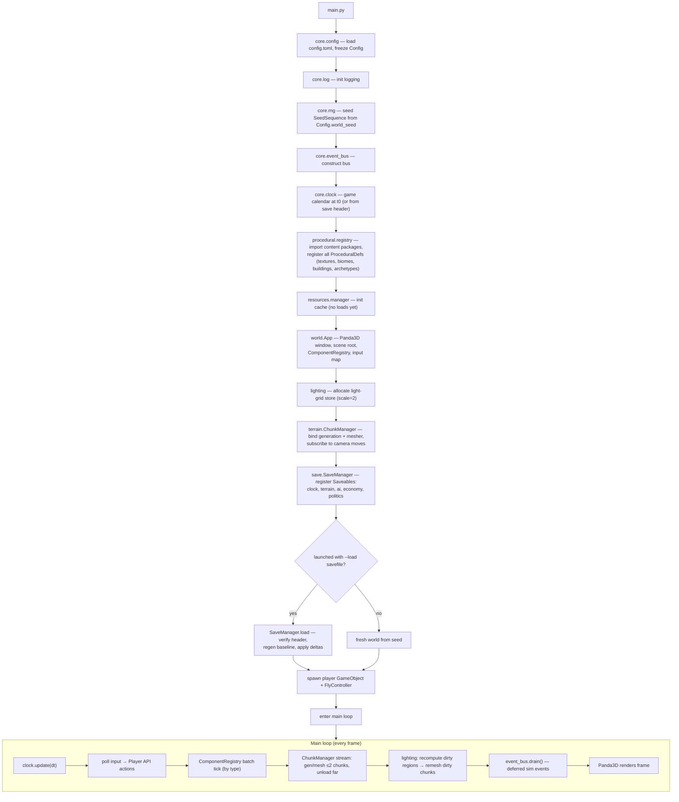
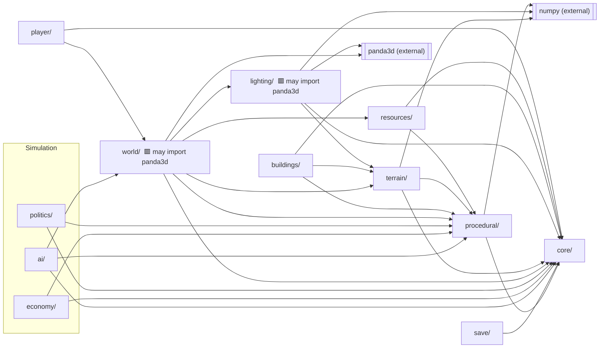
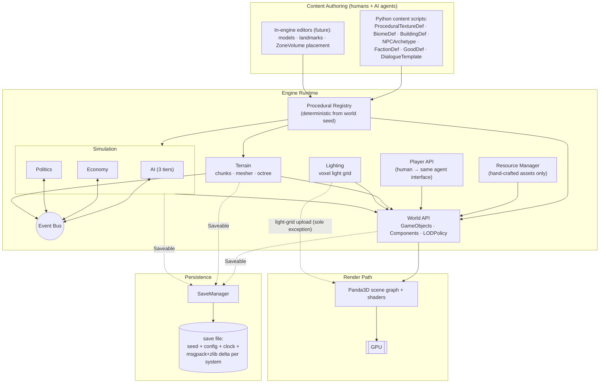
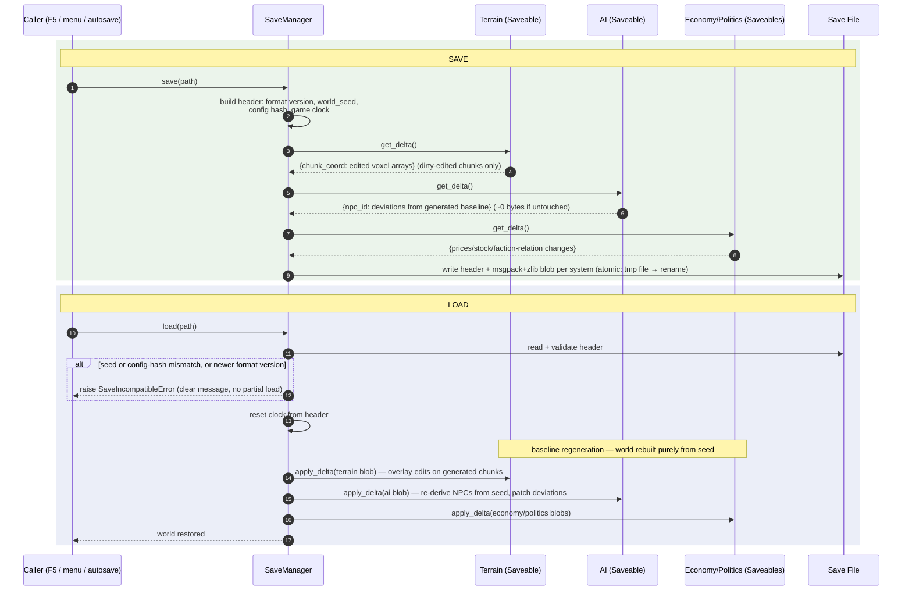

# Torn Apart — Engine Architecture v2
*Last updated: June 9, 2026 | Status: Pre-production → Session 1 implementation*
*Supersedes: fire_engine_architecture.md (v1). All deviations from v1 are listed in the Changelog (§10).*

---

## 1. Project Overview

**Torn Apart** is a fantasy post-apocalyptic sandbox RPG set on the east coast of North America (initial scope: southern Quebec to southern Pennsylvania). Single-developer passion project; not scoped for commercial timelines.

### Core Design Philosophy
- The player is mechanically identical to any NPC. The only distinction is human control.
- The world is a living simulation that runs whether or not the player is engaged.
- Everything possible in the game world is possible for the player — and vice versa.
- No loading screens. All interiors are physically present in the world.

### Tone & Setting
- Fantasy post-apocalyptic: civilization collapsed centuries ago; magic returned, steam tech re-emerged, arcane knowledge mingles with salvaged pre-war tech.
- **Visual style:** late-90s hard-edged polygon terrain and low-poly blocky architecture (Daggerfall, early Fallout) rendered with modern lighting: voxel-grid GI, bounce light, dynamic shadows.
- **Influences:** Kenshi (player = NPC parity), RimWorld (faction sim), Fallout (tone, agency), Daggerfall (scale, proc-gen).

### Scale Target
- 10,000+ named NPCs with backstory, schedule, relationships, simulated history. All killable.
- Full economic simulation: prices vary by location, supply, faction tech level.
- Players can become merchants, warlords, farmers, town founders — no forced narrative.

---

## 2. Locked Decisions (were "Open Questions" in v1)

| Decision | Value | Rationale | Revisable? |
|---|---|---|---|
| Terrain voxel size | **0.5 m** | Owner decision. Fine enough for stairs/walls, coarse enough for scale. | Costly to change later — treat as fixed. |
| Chunk dimensions | **32³ voxels (16 m cube)** | Small enough that an edit remeshes in <1 frame budget; large enough to keep chunk count manageable. | Single constant `CHUNK_SIZE`; cheap to change pre-content. |
| Light grid scale | **1 light voxel = 2×2×2 terrain voxels (1.0 m cells)** | Owner intent ("8 per terrain voxel" read as 8 terrain voxels per light voxel — coarser grid per v1). Config `light_grid_scale = 2`. | Trivial — one config value. |
| Save format | **`SaveManager` with delta encoding — no pickle** (owner decision 2026-06-09) | World seed + config fully determine the baseline; saves store only deviations, encoded as compressed msgpack per system (inspectable via a `tools/dump_save.py` viewer). Un-deviated NPCs cost ~0 bytes. | Encoding details isolated behind `SaveManager`. |
| Lighting compute | **CPU light grid first (numpy), GPU compute shader later** | Day-1 GPU compute is high-risk/low-reward; CPU sunlight pass proves the data model. The grid layout is GPU-uploadable as-is. | Phase 4+ upgrade path documented. |
| Cython | **Not in Session 1. numpy-vectorized Python first; Cython only after profiling shows a wall.** | Build toolchain friction on day 1 buys nothing; most "hot loops" should be numpy array ops anyway, which Cython won't beat by much. | Module layout keeps hot paths isolated for later compilation. |
| Physics | Basic AABB + voxel collision initially; Bullet (via Panda3D) deferred. | Unchanged from v1. | Yes. |
| Networking | Out of scope; don't preclude. | Unchanged from v1. | — |
| Dialogue/TTS | Deferred (Piper is the leading candidate — local, fast, name substitution feasible). | Unchanged from v1. | Yes. |

---

## 3. Technical Stack

| Layer | Technology |
|---|---|
| Language | Python 3.11+ (numpy for hot paths; Cython later, only where profiling justifies) |
| 3D Rendering | Panda3D (as rendering SDK, not full engine) |
| Terrain | Voxel grid, 0.5 m voxels, 32³-voxel chunks, octree-accelerated queries |
| Lighting | Coarser voxel light grid (1 m cells), CPU-computed v0 → GPU compute later |
| Procedural Gen | Python-script-driven; all content defined as Python classes |
| Serialization | `SaveManager` — delta saves (seed + per-system compressed deltas; no pickle) |
| Distribution | Deferred. (v1 said "Cython → C binary"; realistic path is PyInstaller/Nuitka. Decide much later.) |

### Panda3D Role
Rendering SDK only: scene graph, shader pipeline, window/input, low-level asset formats. All game logic, simulation, world management is ours. **Only `world/` and `lighting/` may import panda3d.** Everything else is engine-agnostic Python — this keeps the simulation testable headless (critical: most automated tests run without a window).

---

## 4. Layered Architecture

### Communication Rules (revised — see Changelog #1)
1. **Downward calls are direct.** A layer may call any layer *below* it through that layer's public API (its `__init__.py` exports). Layer skipping downward is allowed (e.g., Terrain → Procedural directly). This replaces v1's "event bus for everything."
2. **Upward and sideways communication uses the Event Bus.** Terrain never calls AI; it publishes `TerrainEditedEvent` and whoever cares subscribes.
3. **The Event Bus is banned from per-frame hot paths.** Per-voxel, per-vertex, per-light-cell work uses direct calls and numpy arrays. Events are for *state changes* (an NPC died, a price moved, a chunk finished loading), not data plumbing.
4. **Only the World API issues render commands to Panda3D.** The Lighting API is the one exception (it owns light-grid GPU upload).
5. **Foundation layers (Core, Procedural) are callable from anywhere.** v1 said both "each layer talks only to the layer directly below" *and* "Procedural is called by all" — contradiction resolved in favor of the latter.
6. **Everything is a Python object.** Content (textures, biomes, buildings, NPC archetypes, factions) is authored as Python classes, never opaque data files. The whole game is scriptable by AI agents.

### Layer Stack



**Reading the stack:** solid arrows = "may call directly downward." Any layer may additionally call the Foundation row directly, and any layer may publish/subscribe on the Event Bus for upward/sideways communication. Lighting is the only non-World layer allowed to touch the GPU.

---

## 4a. System Diagrams

### 4a.1 Startup Sequence
Boot order matters: RNG before anything procedural, content registration before world/terrain init, SaveManager registration after every `Saveable` exists, window last-but-one so failures fail fast and headless tools can reuse the same boot path minus `world.App`.



### 4a.2 Module Dependency Map
Arrow = "imports / calls directly." Anything not shown communicates via Event Bus only. This is the enforceable import graph — a dependency not on this map is a review failure.



Notes: `save/` deliberately depends on nothing above `core` — systems register *into* it as `Saveable`s at boot (inversion of control), so adding a new system never touches save code. `terrain → world` mesh handoff is data-only (numpy arrays returned to `world`'s geometry bridge), not an import of `world`.

### 4a.3 Whole-System View
How the four halves of the software — authoring, simulation, render path, persistence — fit together at runtime.



### 4a.4 Save / Load Flow
Saves never serialize live objects: each system reports *deviations from its procedural baseline* as plain dicts; load = regenerate baseline from seed, then overlay deltas.



Inspection path: `python tools/dump_save.py <file>` prints the header, each system's delta keys, and compressed/uncompressed sizes — the "viewable save" requirement without sacrificing compactness.

---

## 5. API Specifications

### 5.1 Core (Event Bus + Utilities)
- **Event Bus:** typed Python event objects (`NPCDeathEvent`, `ChunkLoadedEvent`, `PriceChangedEvent`...). `subscribe(EventType, handler)`, `publish(event)`. Synchronous dispatch for in-frame events; queued dispatch (`publish_deferred`) drained once per tick for sim events.
- **RNG service:** *all* randomness flows through `core.rng`. `rng.for_domain("terrain", chunk_coord)` returns a deterministic child generator from the world seed. No bare `random` or unseeded `np.random` anywhere — this is what makes delta saves and reproducible bugs possible.
- **Config:** single typed config object loaded at boot (world seed, chunk size, light grid scale, view distance, debug flags).
- **Clock:** owns real-frame `dt` and the game-time calendar (day/season). Publishes `GameDayTickEvent` for the world-map AI tier.

### 5.2 Procedural API
Foundation for all generation. Deterministic from seed: same seed → same world, always.

- `ProceduralDef` base class + **registry**: `procedural.register(def_instance)`, `procedural.get("wasteland_ground")`. Generated results cached by `(def_name, seed, params)`.
- **`TextureGenerator`** — procedural texture synthesis to numpy RGBA arrays (no external texture files for environment). Nearest-neighbor filtering at render time for the retro look.
- **`BiomeDef`** — rules for terrain features, vegetation, ground materials per zone.
- **`ZoneVolume`** — developer/agent-placed tagged volumes (`forest`, `urban_dense`, `ruined_industrial`...); Procedural API interprets tags to fill them.
- **`PlacementRules`** — per-zone density/type/randomization parameters.

AI agents add content by subclassing `ProceduralDef` in plain Python and registering it. No compiled code, ever, for content.

### 5.3 Resource Manager API
The only place raw asset file I/O occurs. Loads hand-crafted assets (models `.egg`/`.bam`/`.gltf`, sounds, landmark buildings, player hands) from disk; sources environment textures from the Procedural API. In-memory cache with reference-counted unload.

### 5.4 World API
Scene-graph wrapper; sole render caller. **The object model deliberately copies the Unity API** (owner decision 2026-06-09) — same names, same semantics, snake_case — so anyone (human or AI agent) who knows Unity can author here with zero relearning.

```python
class GameObject:
    # --- identity ---
    id: UUID
    name: str
    tag: str                      # single primary tag, Unity-style
    layer: int                    # render/physics layer mask index
    active_self: bool             # set via set_active(); active_in_hierarchy derived
    transform: Transform          # always present; cannot be removed

    def add_component(self, t: type[T], **kwargs) -> T: ...   # constructs, attaches, schedules awake/start
    def get_component(self, t: type[T]) -> T | None: ...
    def get_components(self, t: type[T]) -> list[T]: ...
    def get_component_in_children(self, t: type[T]) -> T | None: ...
    def remove_component(self, c: Component) -> None: ...      # triggers on_destroy on that component
    def set_active(self, value: bool) -> None: ...             # cascades on_enable/on_disable
    def compare_tag(self, tag: str) -> bool: ...

# module-level, mirroring Unity statics:
world.instantiate(template, position=Vec3, rotation=Quat, parent=None) -> GameObject
world.destroy(obj: GameObject | Component, delay: float = 0.0) -> None   # deferred to end of frame
world.find_with_tag(tag) -> GameObject | None
world.find_objects_with_tag(tag) -> list[GameObject]

class Component:
    game_object: GameObject
    transform: Transform          # convenience alias, as in Unity
    enabled: bool
    # lifecycle — Unity order, guaranteed:
    def awake(self) -> None: ...        # on creation, before any start; runs even if disabled
    def on_enable(self) -> None: ...
    def start(self) -> None: ...        # before first update, after all awakes that frame
    def update(self, dt: float) -> None: ...
    def late_update(self, dt: float) -> None: ...   # after all updates (camera follow etc.)
    def fixed_update(self, dt: float) -> None: ...  # fixed-step sim tick (default 50 Hz accumulator)
    def on_disable(self) -> None: ...
    def on_destroy(self) -> None: ...
```

**Transform — quaternion-based (owner decision 2026-06-09).** Rotation is stored *only* as a quaternion; Euler angles exist solely as a convenience view at the API edge (`from_euler`/`as_euler`), never as stored state — no gimbal lock, clean slerp for NPC turning and camera blends.

```python
class Transform:
    # hierarchy
    parent: Transform | None
    children: tuple[Transform, ...]
    def set_parent(self, p: Transform | None, keep_world: bool = True) -> None: ...
    # state (world-space properties derive through parent chain, cached + dirty-flagged)
    position: Vec3            # world; local_position for local
    rotation: Quat            # world; local_rotation for local
    local_scale: Vec3
    # directions (Z-up, Panda3D native: forward = +Y, right = +X, up = +Z)
    forward: Vec3; right: Vec3; up: Vec3
    # ops
    def translate(self, v: Vec3, relative_to: Space = Space.SELF) -> None: ...
    def rotate(self, q: Quat, relative_to: Space = Space.SELF) -> None: ...
    def look_at(self, target: Vec3, up: Vec3 = Vec3.UP) -> None: ...
    def transform_point(self, p: Vec3) -> Vec3: ...    # local → world
    def inverse_transform_point(self, p: Vec3) -> Vec3: ...
```

`Vec3` and `Quat` live in **`core/math3d.py`** (pure numpy — float32, array-backed) so the entire object model is headless-testable; `world/` converts to Panda3D types only at the scene-graph boundary. `Quat` API: `identity()`, `from_axis_angle(axis, radians)`, `from_euler(h, p, r)`, `as_euler()`, `slerp(a, b, t)`, `q1 * q2`, `q.rotate(vec3)`, `normalized()`. Axis convention is **Z-up** (Panda3D native), not Unity's Y-up — the API shape is Unity's; the coordinate system is ours, stated once here and never converted ad hoc.

**Deliberate deviations from Unity** (documented so nobody "fixes" them): no coroutines (use components + the Clock); no reflection-based message passing (`SendMessage`) — use the Event Bus; prefab role is played by `ProceduralDef` templates; and **execution is batched by component type** (Changelog #4): the World API runs `awake → on_enable → start` queues then `update/late_update/fixed_update` per *type bucket*, not per object. Unity semantics, batched mechanics — with 10k+ NPCs, per-object Python dispatch is not survivable, and type buckets leave the door open to array-backed component storage later without changing this authoring API.

**LOD:** a single shared `LODPolicy` object in `core` defines distance bands. World API (objects) and Terrain API (chunks) both read the *same* policy so geometry, placement density, and shadow detail transition together.

### 5.5 Terrain API
Voxel terrain: 0.5 m voxels, 32³-voxel chunks (16 m cubes), chunk storage as numpy `uint8`/`uint16` material arrays. Octree over chunks for queries; LOD via merged/simplified distant meshes.

- **Meshing:** culled face extraction (emit faces only where a neighbor is air), numpy-vectorized, flat per-face normals — no smooth interpolation. This *is* the retro look.
- **Runtime editing is brush-based (owner decision 2026-06-09).** Players never dig/place voxels directly; terrain stays mostly static. All edits flow through one volumetric API used by gameplay systems (explosives, construction, mining tools):
  `terrain.apply_brush(shape: SphereBrush | BoxBrush | CylinderBrush, center: Vec3, mode: ADD | REMOVE, material: int)` — the brush rasterizes to a voxel mask (one vectorized numpy op per intersected chunk), affected chunks go dirty → remesh + relight → edit recorded in the save delta. An explosion is just a `SphereBrush(REMOVE)`; a future construction system is `BoxBrush(ADD)`. Demo/debug builds may bind brushes to mouse clicks — that's a dev tool, not a player verb.
- **Streaming:** chunks load/unload by camera proximity (radius from `LODPolicy`); content generated from seed + zone volumes, deltas applied on top.

### 5.6 Lighting API
The exception to "only World renders": owns its GPU uploads.

- Light grid at `light_grid_scale = 2` (1 m cells), stored per loaded chunk region as numpy arrays.
- **v0 (Session 1):** CPU sunlight column pass — march down each column; full sun above first occupied cell, ambient below; one cheap lateral diffusion pass for soft edges. Sampled at mesh-build time into vertex colors.
- **v1+:** flood-fill point lights (torches, magic), 1–2 bounce propagation, dirty-region recompute, 3D-texture upload sampled in fragment shader, GPU compute port.
- All lights (sun, torch, explosion, spell) register here.

### 5.7 Building Manager API
Free-form **floorplan** buildings (owner decision 2026-06-12, superseding the v1 "blocks + primitives" wording): a `Building` carries one world transform (position + quaternion, arbitrary rotation on any axis) and stacked per-storey 2-D plans — walls are straight segments or circular arcs (`bulge` scalar) with real thickness and parametric window/door openings; foundations, floor/ceiling slabs and flat roofs complete the envelope; **rooms are first-class objects** (auto-detected from wall topology or explicitly authored) so furnishing can be generated per room later. Buildings are meshed directly to triangles (`MeshArrays`, the terrain contract) and are NOT voxel-aligned; only hand-crafted landmarks come from the Resource Manager. Procedural buildings at runtime come from `BuildingDef` scripts (subclass of `ProceduralDef`) that drive the same imperative authoring API: footprint, floor count, room layout, façade, furniture rules. Furniture/clutter placed via `ZoneVolume` tags inside buildings. See `docs/systems/buildings.md`.

### 5.8 AI API *(stubs in Session 1; deep implementation future scope)*
Tiered simulation for 10k+ agents:

| Tier | Count | Detail | Rate |
|---|---|---|---|
| Active | ~50–200 near player | Full AI, pathfinding, conversation | Every frame |
| Regional | Same region | Lightweight goal pursuit, trade, combat resolution | Every N frames |
| World Map | All others | Statistical outcomes per game day | `GameDayTickEvent` |

Promotion/demotion as the player moves. World-map tick must be array-based (one numpy pass over all agents), not 10k Python objects — this is the design constraint that makes the tier viable; Cython only if numpy isn't enough. Each NPC: name, generated backstory, schedule, relationship graph, emotional state, event memory. Dialogue: template library + runtime selection; TTS with player-name substitution (deferred).

### 5.9 Economy API *(stub in Session 1)*
Per-settlement inventories with supply/demand curves; prices vary by location, faction tech, events. NPCs and player use identical pricing paths. Trade routes, hired managers, arbitrage.

### 5.10 Politics API *(stub in Session 1)*
Faction ownership of settlements, relations (war/allied/neutral/trading), world-map events (raids, expansion, collapse). Publishes events consumed by Economy (war disrupts routes) and AI (allegiance, morale).

### 5.11 Player API
Thin wrapper giving a human the same interface as an NPC agent: input → the *same* action calls NPCs use. No special-cased player logic. **Session 1:** free-fly camera controller only (not yet an embodied agent).

### 5.12 SaveManager (new — Changelog #5)
Delta saves from day one. No pickle (owner decision 2026-06-09).

```python
class Saveable(Protocol):
    save_key: str                                   # e.g. "terrain", "ai"
    def get_delta(self) -> dict: ...                # deviations from procedural baseline only
    def apply_delta(self, delta: dict) -> None: ... # called after baseline regen from seed
```
- A save = world seed + config + game clock + one compressed msgpack blob per registered `Saveable` (terrain edits keyed by chunk coord, NPC deviations keyed by NPC id, economy/politics state).
- Load = regenerate baseline from seed → `apply_delta` per system. Un-deviated content costs ~0 bytes — this is what makes 10k NPCs saveable.
- Deltas are plain dicts of primitives/arrays (no live object refs), so saves survive refactors and `tools/dump_save.py` can pretty-print any save for inspection.
- Game code never touches encoding; only `SaveManager` knows it's msgpack+zlib.

---

## 6. Editor / Tooling
Minimal in-engine GUI editor (later sessions): model/skeleton editor, landmark building editor, `ZoneVolume` placement tool. Everything else is authored as Python scripts. Session 1 ships only debug overlays (FPS, chunk borders, light-grid view).

## 7. Map & World Generation
- Terrain semi-procedural: developer places `ZoneVolume` markers; Procedural API fills detail. Countryside fully procedural; cities semi-procedural (hand-placed landmarks, generated blocks/streets).
- Initial geography: southern Quebec → southern Pennsylvania.
- 100% procedural environment textures.
- **Session 1 worldgen:** layered value-noise heightmap → voxel fill. Biomes/zones come next session.

## 8. Content Authoring via AI Agents

| Content Type | Base Class | Agent adds... |
|---|---|---|
| Texture | `ProceduralTextureDef` | New material looks |
| Biome | `BiomeDef` | New terrain zone types |
| Building | `BuildingDef` | New building archetypes |
| NPC archetype | `NPCArchetype` | New character types |
| Faction | `FactionDef` | New factions |
| Dialogue | `DialogueTemplate` | New conversation trees |
| Economy good | `GoodDef` | New tradeable items |

Internal documentation (docstrings, type hints, per-API README) is the prompt context for agents. **Verbose, consistent docs are a first-class requirement** — enforced in CLAUDE.md.

---

## 9. Performance Reality Check (read before optimizing)
- The renderer is C++ (Panda3D); Python only orchestrates. Per-frame Python work must stay in the low thousands of operations — everything bulk goes through numpy or into the scene graph once.
- Known future walls, in expected order: light propagation (→ GPU compute), active-tier AI pathfinding (→ Cython or rust ext), distant-chunk meshing (→ worker process). None are Session 1 problems; the module boundaries above isolate each so it can be swapped without redesign.

## 10. Changelog from v1
1. **Event bus demoted from "all communication" to "upward/sideways state-change notifications."** Direct downward calls allowed. Pub/sub on render/terrain hot paths in Python would cost more than the work it dispatches.
2. **Layer-skip contradiction resolved:** Core and Procedural are foundation layers callable from anywhere (v1 already required this implicitly).
3. **Cython removed from Session 1**; numpy-first policy with profiling gates (§9). "Cython → C binary" distribution claim corrected to "deferred; PyInstaller/Nuitka likely."
4. **Component ticking is batched by type**, not per-GameObject — same authoring API, survivable at 10k NPCs.
5. **SaveManager added** (owner discussion 2026-06-09): delta saves from day one via `Saveable` protocol; pickle considered and rejected (refactor-fragile, not inspectable, abandons the delta idea).
6. **Lighting v0 is CPU** (sunlight column pass baked to vertex colors); GPU compute is an upgrade, not a prerequisite.
7. **Open questions locked** (§2): 0.5 m voxels, 32³ chunks, light scale 2, save approach.
8. **Headless-testability rule added:** only `world/` and `lighting/` may import panda3d.
9. **Object model re-specced as a Unity API clone** (owner decision 2026-06-09): Unity lifecycle (`awake/start/update/late_update/fixed_update/on_enable/on_disable/on_destroy`), `instantiate/destroy/find_with_tag`, tag/layer/active. Transform stores rotation as **quaternion only** (`core/math3d.Quat`, numpy-backed, Z-up); Euler is a view, never state. Deviations from Unity (no coroutines, no SendMessage, batched execution) documented in §5.4.
