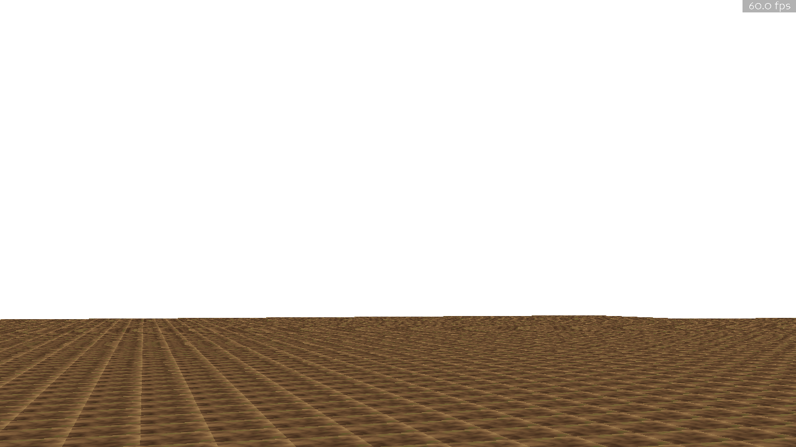
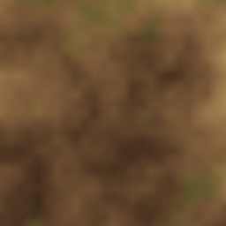
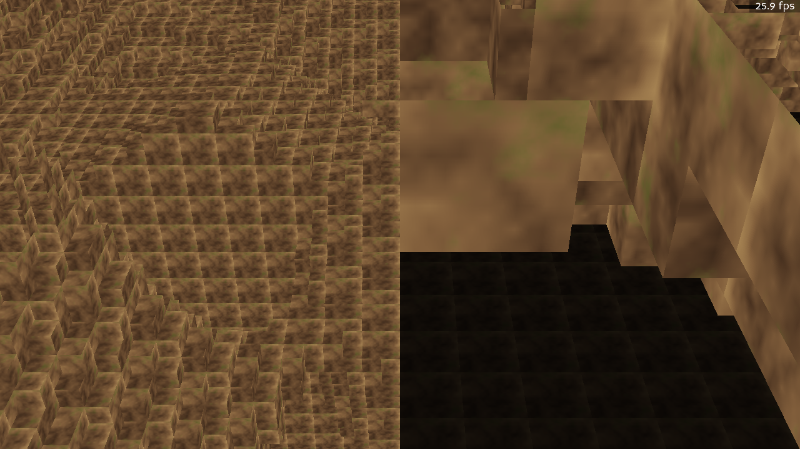
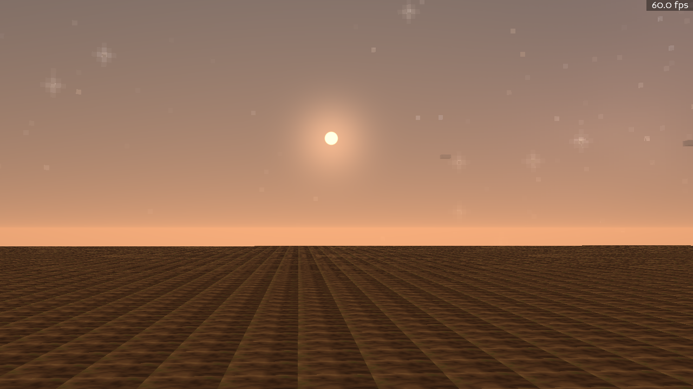
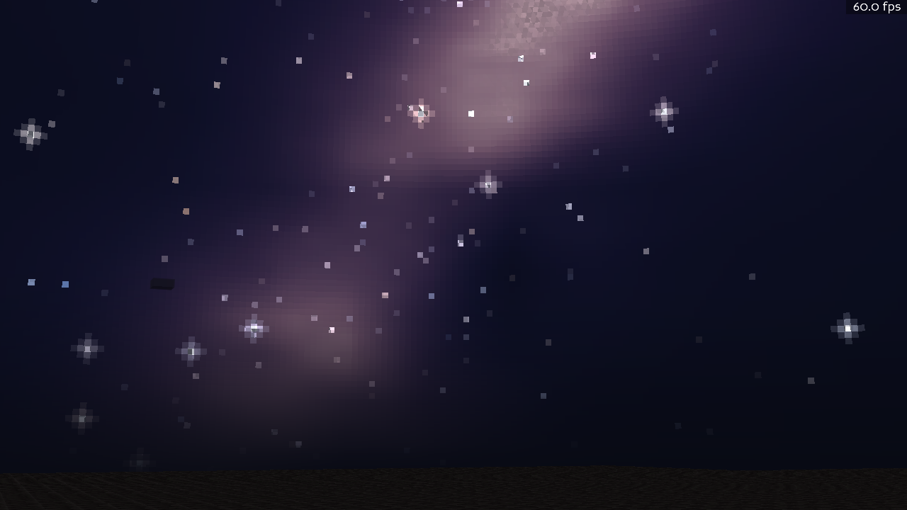
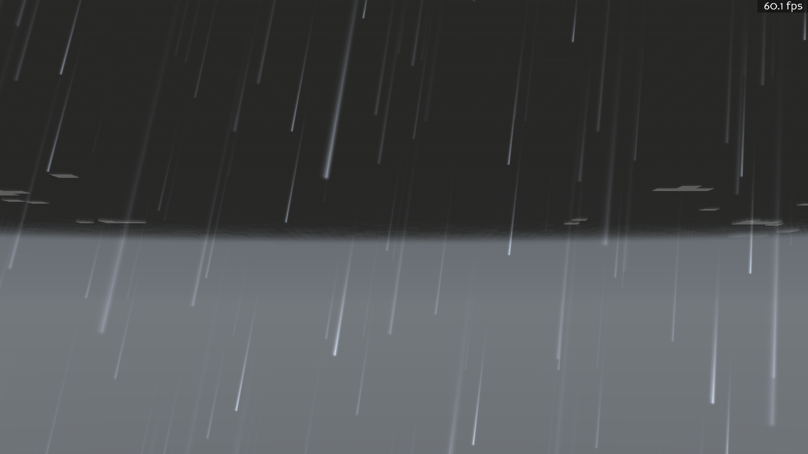
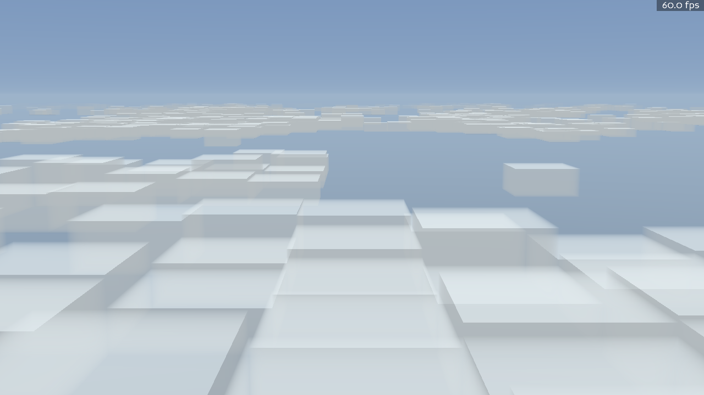
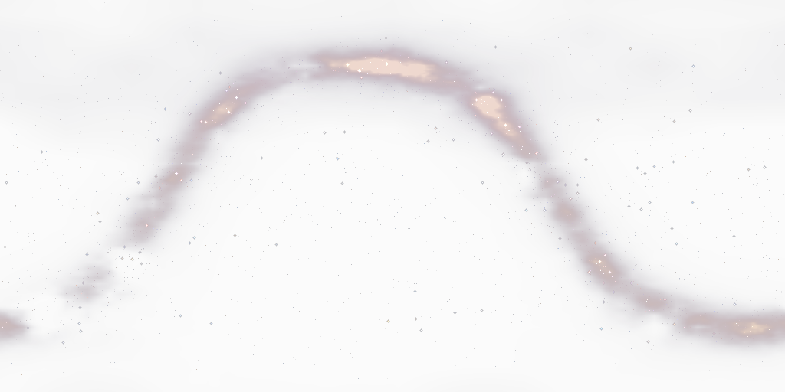

# Part 1 — Foundations (Day 1: June 9, 2026)

[← Back to the progression index](README.md) · [Next: Light and Sky →](02-light-and-sky.md)

Day one produced a playable vertical slice: a free-fly camera over a deterministic voxel
world, procedural ground textures, left-click explosions that carve craters, quick save /
quick load as compact deltas, and — by the end of the same day — a first procedural sky with
its own weather system. 257 headless tests were green by the first commit series.

## The first light

The very first thing the engine ever rendered: a flat plane of procedurally textured voxels
under a blank sky.

*Humble beginnings. The ground texture is already procedural — generated from the world seed,
not loaded from disk.*

That texture comes from the `ProceduralTextureDef` pipeline, which renders material
definitions like `wasteland_ground` to tiles entirely in numpy:

*`python tools/preview_texture.py wasteland_ground` — the same command the agents used to
check their texture work without launching the game.*

## Terrain with real shape

By that evening the world had hills, valleys, and baked sunlight. This is a screenshot the
project owner took in-game on day one (note the window title bar):

*June 9, 21:12 — rolling voxel terrain at 156 fps. Every chunk is generated, meshed, and
streamed deterministically from the world seed.*

## Blowing holes in it

The signature interaction from day one: left-click fires an explosion that raycasts the voxel
field and carves a sphere-brush crater. The edit marks chunks dirty, republishes light, and
remeshes — the crater appears and relights within a frame or two, and quick-save stores only
the edited chunks as a delta.

*Inside a crater: hard-edged voxel walls with the sunlight pass leaving carved undersides in
shadow.*

## A sky, before the day was out

Day one didn't stop at terrain. A second session added a fully procedural sky: gradient
atmosphere, a sun that rises in the east and sets in the west, boxy ray-marched clouds, and a
night sky with a procedural galaxy of ~2,500 twinkling stars — plus a seeded Markov weather
system cycling clear, cloudy, overcast, fog, rain, and storm.

| | |
|---|---|
|  |  |
| *Dawn: the procedural sun low over the wasteland.* | *Midnight: the procedural galaxy band and starfield.* |
|  |  |
| *A storm state: rain streaks under a dark cloud deck.* | *Flying above the cloud slab — the world has a ceiling now.* |

The galaxy itself is a generated texture — seeded, deterministic, unique to this world:

*The Milky-Way-style galaxy band, painted procedurally into a sky texture from the world seed.*

## What day one locked in

The decisions from these first commits still govern the codebase (see
[`DECISIONS.md`](../../DECISIONS.md)):

- **Determinism everywhere** — all randomness flows through seeded, domain-keyed RNG. Same
  seed, same world.
- **Saves are deltas, never pickles** — a save is the seed plus per-system diffs.
- **Headless-first** — the rendering SDK is quarantined behind a bridge package; everything
  else runs and is tested without a GPU.

[← Back to the progression index](README.md) · [Next: Light and Sky →](02-light-and-sky.md)
