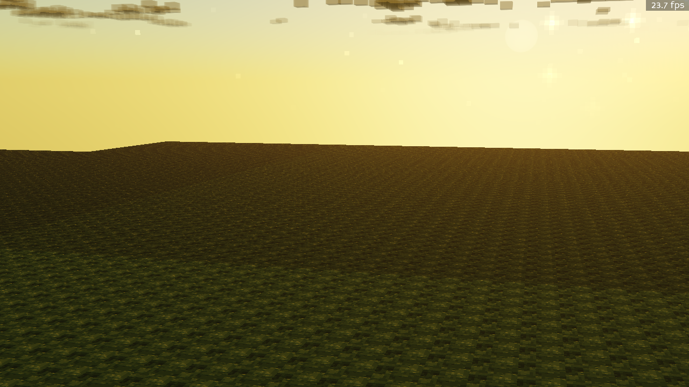
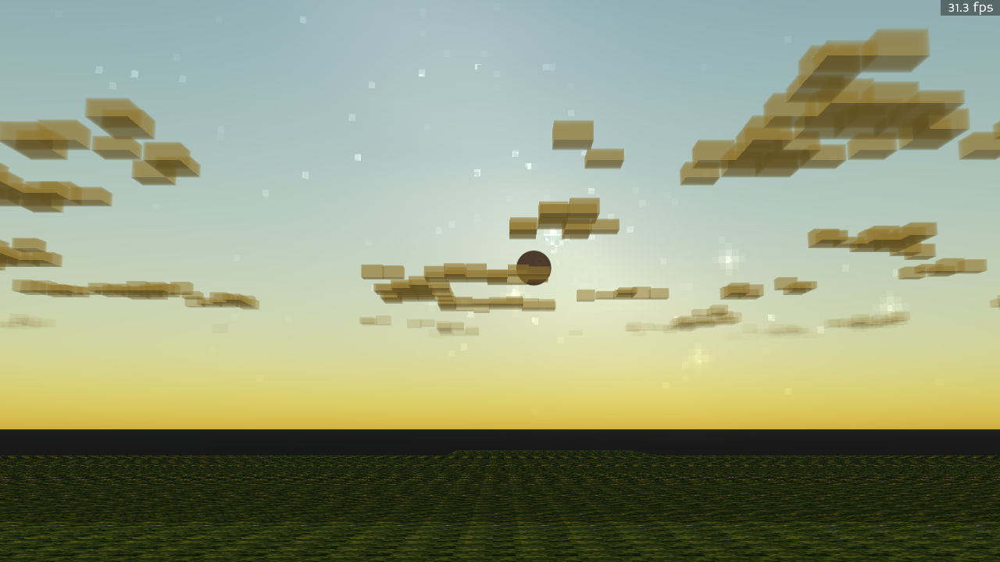
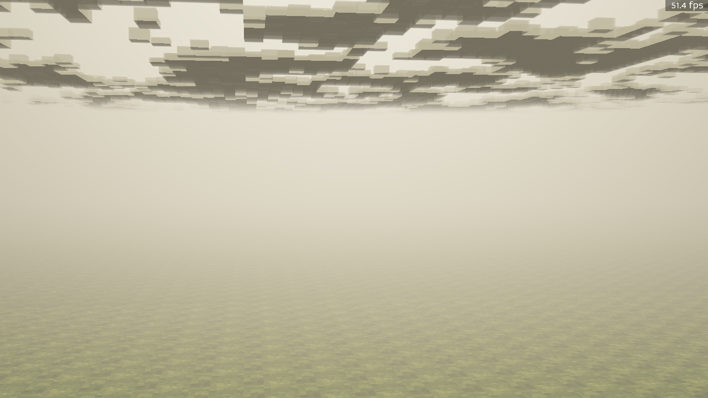
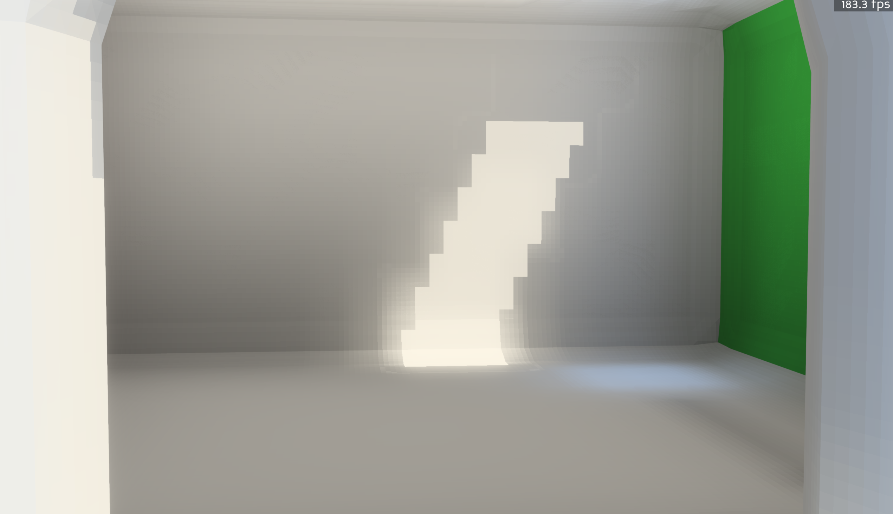
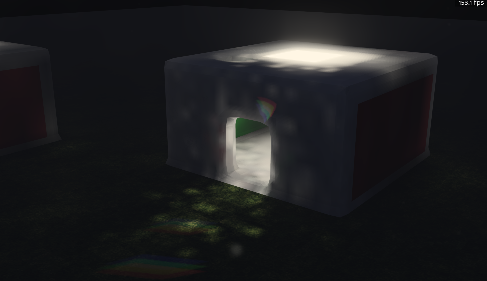
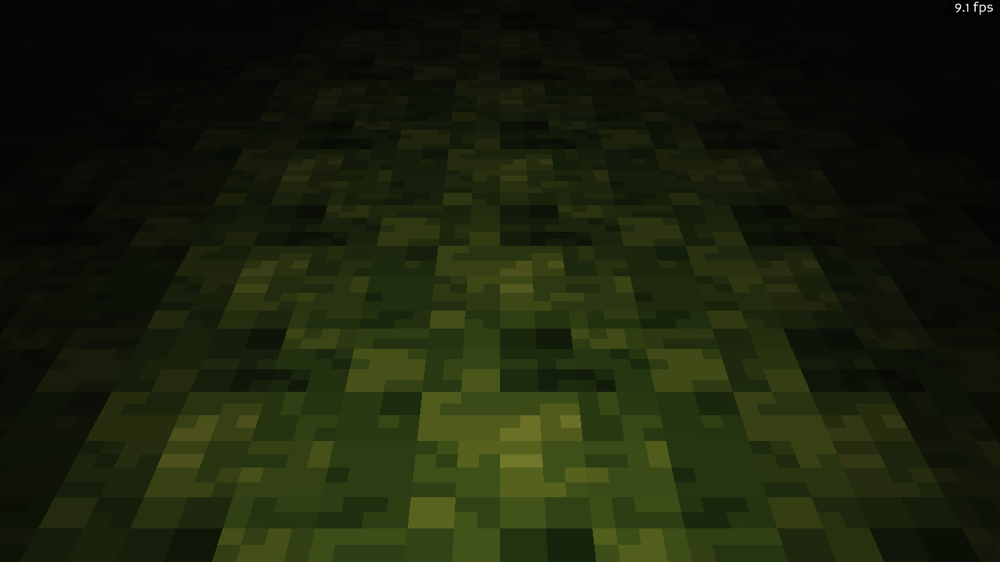
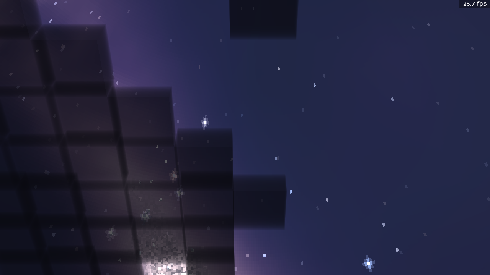
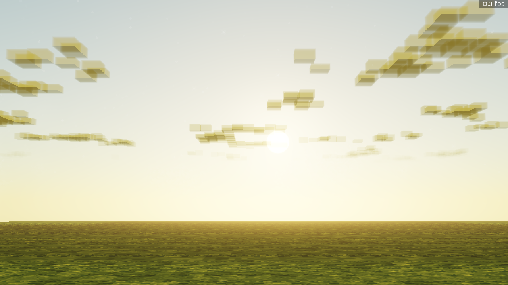
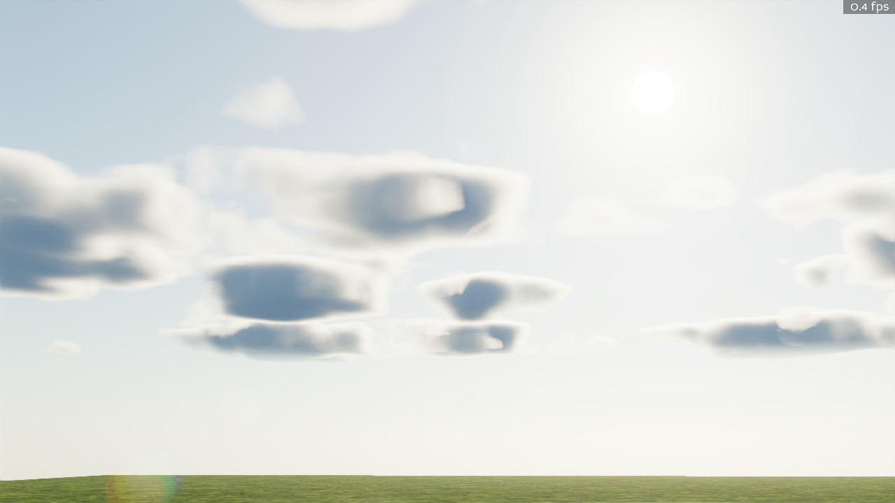

# Part 2 — Light and Sky (Days 2–5: June 10–13, 2026)

[← Part 1: Foundations](01-foundations.md) · [Back to index](README.md) · [Next: A Living World →](03-a-living-world.md)

The single biggest leap in the engine's life: replacing baked per-vertex sunlight with a
**GPU radiance-cascade volumetric lighting system** — three nested cascades of light volumes,
ray-marched voxel shadows, real bounced global illumination, dynamic point/spot lights, and a
physically-based Rayleigh/Mie atmosphere feeding it all. On top of that came a full HDR
post-processing stack: bloom, lens flare, god rays, volumetric clouds, FXAA.

This all happened across roughly seventy-two hours.

## The sun becomes real

With the physical atmosphere driving the light, time of day stopped being a color ramp and
became actual sky radiance:

*Sunset. The terrain is lit by sky radiance sampled from the cascades — note the grazing
warm light on the ridge and the glow around the sun.*

*The sun is a real disc in a real atmosphere now; the boxy clouds catch its color as they
drift.*

*Morning fog: volumetric extinction between the camera and the world, with the cloud deck
overhead.*

## Global illumination you can stand in

The GI system was validated in Cornell-box-style test rooms (press `G` in the demo to build
one). These two shots are from `tools/out/HUMAN_PICTURES/` — captures the project owner took
in-game because they were too good to lose:

*Sunlight enters through an opening and the room fills with soft bounced light — real
ray-marched gather GI, not a screen-space trick. Note the green wall starting to bleed color,
at 183 fps.*

*The same system at night, inverted: an emissive interior spills light out of the doorway
and across the grass.*

Dynamic lights ride the same grid — torches (`L`), a camera flashlight (`F`), and the
transient flash of every explosion:

*The flashlight at night: a spot light injected into the cascades, falling off across the
ground texture.*

*Full moon over a voxel ridge — moonlight is just the sun's night shift in the same pipeline.*

## The HDR pipeline, phase by phase

The post stack was built in nine tracked phases (bloom pyramid → fog punch-through →
volumetric clouds → lens flare → god rays → tuning), each with verification renders archived
under `tools/out/phase2/`…`phase9/`:

*Phase 3: the bloom pyramid. The dawn sun finally over-exposes like a real camera.*

*Phase 9: the finished stack — volumetric ray-marched cumulus, tone-mapped HDR, FXAA. Compare
this sky with day one's.*

## Then it kept improving

Lighting didn't stop when it shipped. Over the following days the agents:

- replaced the original flood-fill GI with a **ray-marched gather** plus smooth de-noising and
  soft shadow penumbrae (June 12),
- unified every surface — terrain, foliage, buildings — under a single **lit-surface GLSL
  contract** so nothing looks pasted-on (June 12),
- added **per-meter Beer-Lambert canopy extinction**, so light genuinely attenuates as it
  travels through leaves instead of switching off under trees (June 13),
- and halved cascade cell sizes for finer mid-range shadows at no VRAM cost (June 13).

The full decision trail is in [`DECISIONS.md`](../../DECISIONS.md).

[← Part 1: Foundations](01-foundations.md) · [Back to index](README.md) · [Next: A Living World →](03-a-living-world.md)
