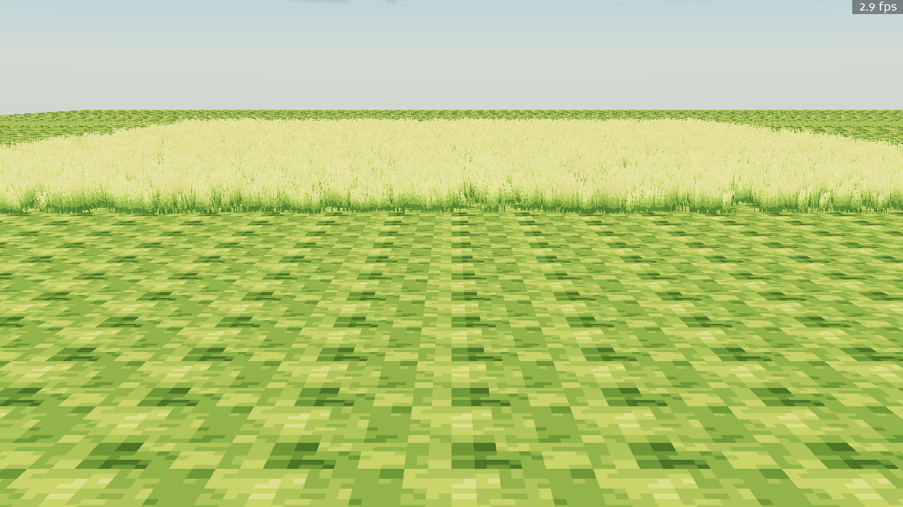
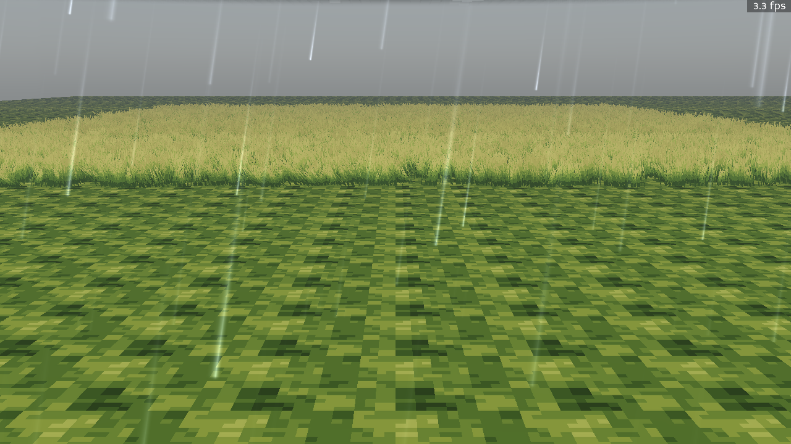
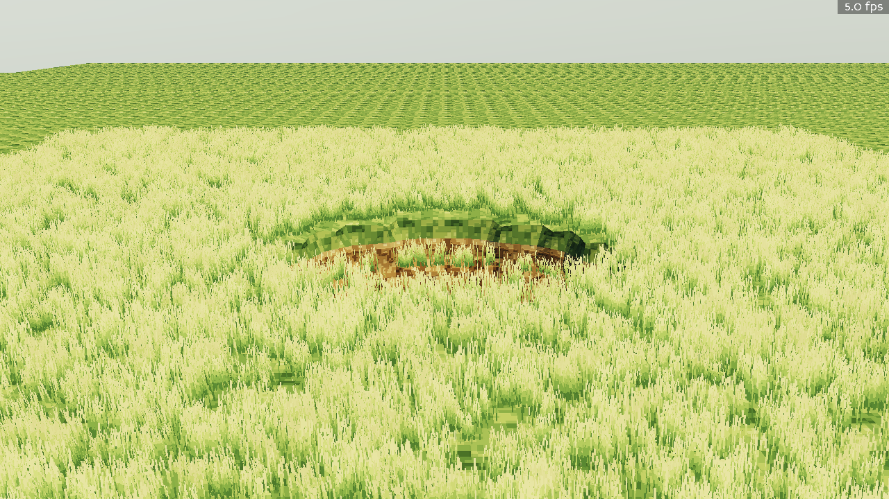
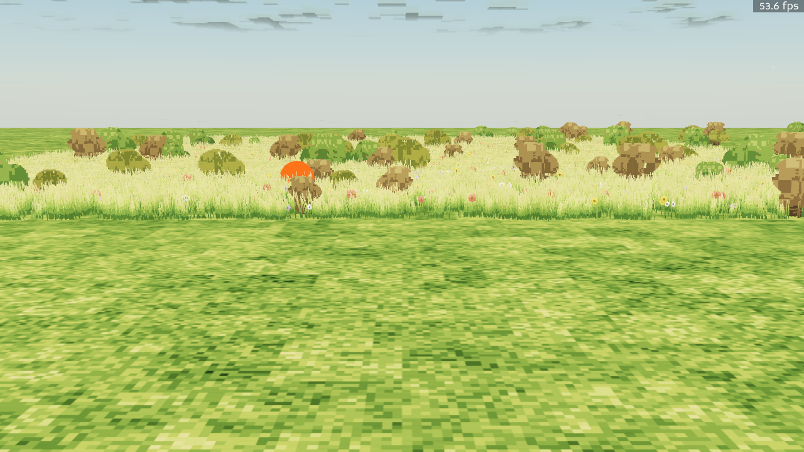
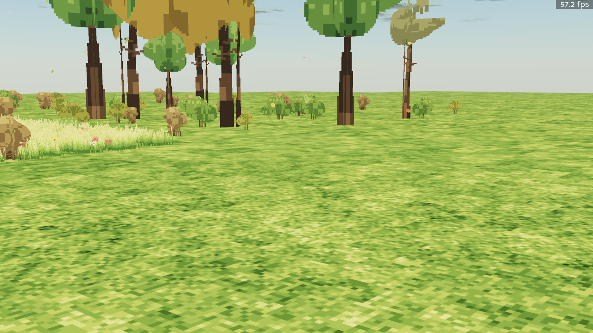
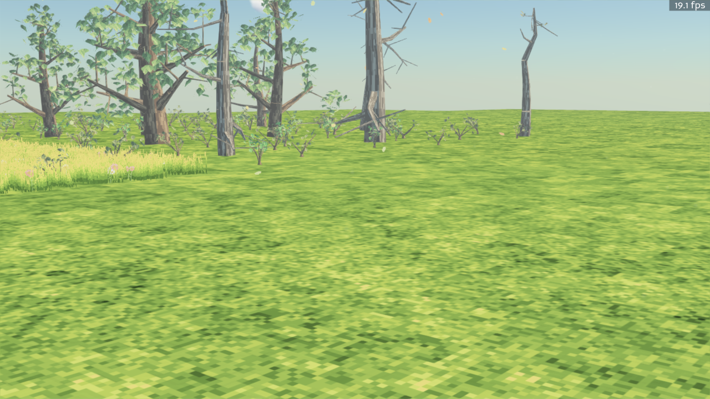
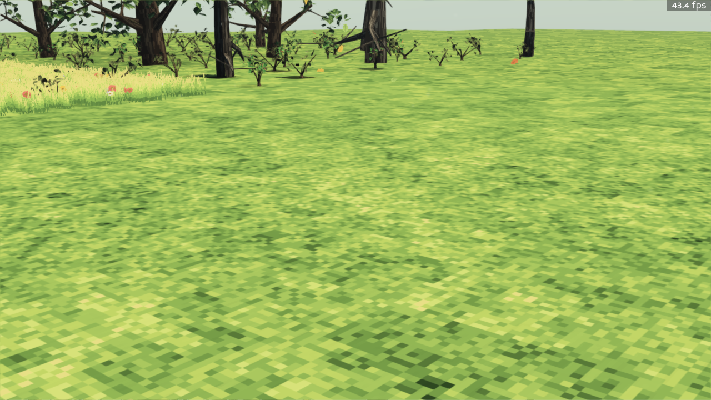
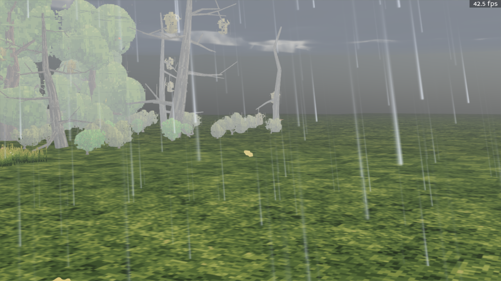

# Part 3 — A Living World (Days 3–5: June 11–13, 2026)

[← Part 2: Light and Sky](02-light-and-sky.md) · [Back to index](README.md) · [Next: Iteration at Machine Speed →](04-iteration-at-machine-speed.md)

With light solved, the world needed life. In three days the agents added instanced grass, a
travelling wind field, meadow flora, real procedurally *grown* 3-D trees, spatially simulated
weather, and a building system — all deterministic, all seeded, all with zero hand-made art.

## Grass

GPU-instanced grass: one shared tuft mesh, thousands of instances placed by a hash chain
inside tagged zone volumes, lit by the radiance cascades and swaying in the wind field.

*Tall grass zones meeting mowed procedural ground texture — every blade is a GPU instance.*

*The same field in a storm: darker sky radiance, rain streaks, and wind-driven sway.*

The grass knows about the world, too — carve a crater and the blades inside it are culled:

*Terrain edits propagate to vegetation: the crater exposes dirt and the grass instances
inside the blast radius disappear.*

## Wind

An invisible system with visible fingerprints everywhere: a spatially varying, time-evolving
wind velocity field (twelve seeded spectral gust modes, costing zero bytes in a save) is
uploaded to the GPU every frame. Gust bands travel across the grass, trees sway with height,
and dust motes and leaf litter ride the flow. You can see it working in the storm shots
above and the tree shots below.

## Flora, first as sprites…

The first pass at vegetation was pixel-art crossed-quad sprites — flowers, bushes, and trees
generated as seeded atlases:

*The sprite-flora meadow: bushes and wildflowers as instanced crossed quads.*

*Sprite trees, one day before real ones. This is the last screenshot of the era.*

## …then as real grown trees

One day later, trees became actual 3-D organisms: trunk and branch skeletons grown
procedurally per species (gnarled oak, dead snag, scrub bush, berry bush — each authored as
a small Python script), with individual leaf cards placed by a cellular automaton, and a
billboard impostor LOD for distant instances.

*Grown oaks with individual-leaf canopies beside dead snags — same growth code, different
species parameters.*

*Canopy extinction at work: light attenuates per meter travelled through leaves, so shade
under a tree is graded, not black.*

## Weather that exists in space

The day-one Markov weather schedule was replaced by **spatial weather**: storm cells that
drift across the map, humidity-driven ground fog, GPU volumetric rain with a rain-cover
heightmap (it does not rain under roofs or dense canopy), WMO cloud genera, and procedural
stepped-leader lightning with delayed thunder.

*A storm cell overhead: volumetric rain, storm-darkened sky radiance, and the wind field
bending whole trees — trunks pinned at the root, canopies swaying.*

## Buildings and zones

The same window produced the headless **building system** — free-form floorplans with walls,
arcs, openings, auto-detected rooms, and slabs, meshed with vectorized numpy and lit by the
same surface contract — and **zone volumes**, the tagged boxes that tell grass, flowers, and
trees where they're allowed to grow. (Buildings shipped data-model-first; their in-game hero
shot is still on the backlog, which is itself an honest artifact of how this was built.)

[← Part 2: Light and Sky](02-light-and-sky.md) · [Back to index](README.md) · [Next: Iteration at Machine Speed →](04-iteration-at-machine-speed.md)
