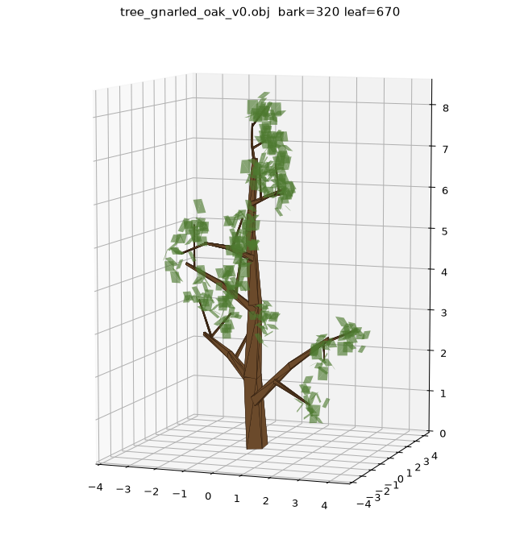
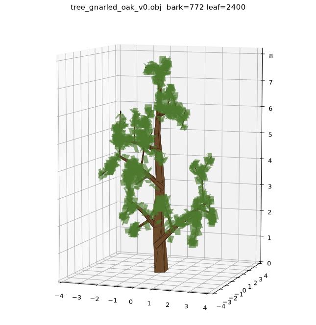
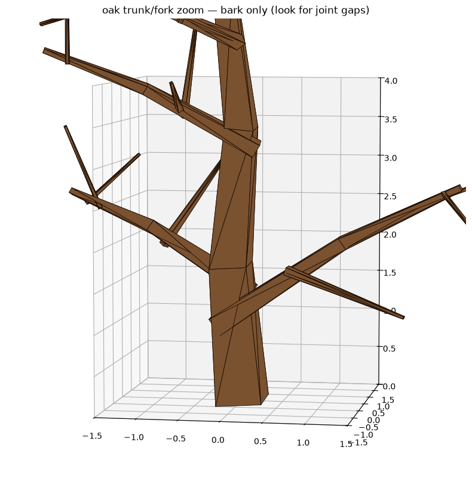
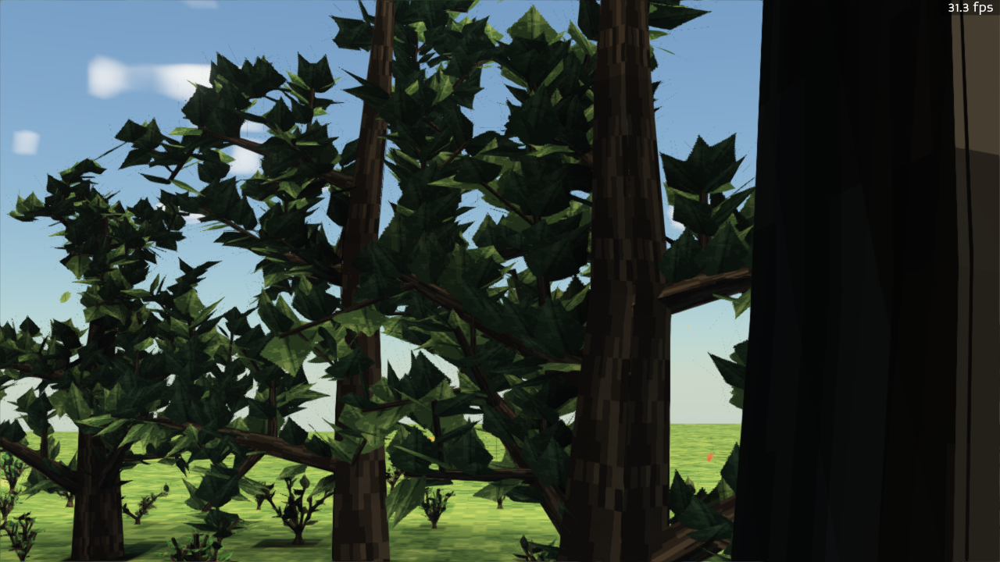
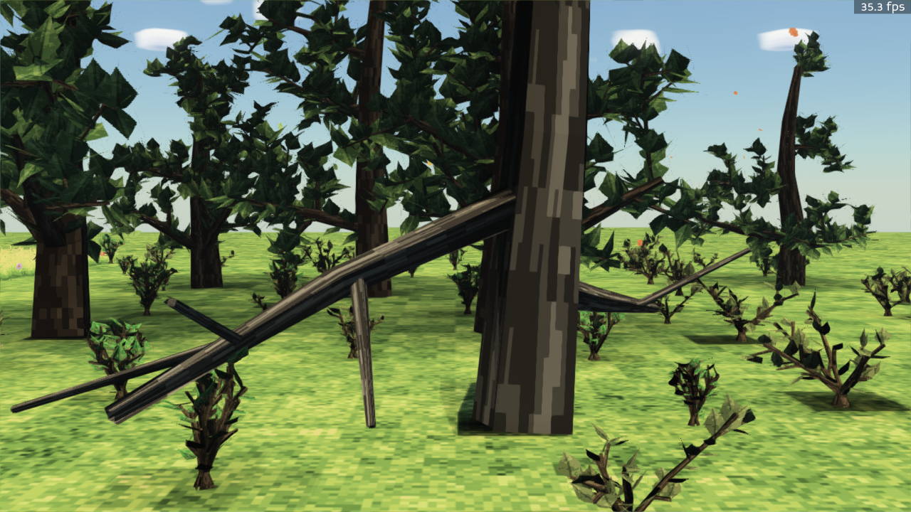

# Part 4 — Iteration at Machine Speed (Days 5–8: June 13–16, 2026)

[← Part 3: A Living World](03-a-living-world.md) · [Back to index](README.md)

The final stretch is the most interesting part of the experiment — not a new rendering
feature, but proof that AI agents can *iterate*: measure, critique their own output, and
converge on quality, while other agents build the tooling that keeps a fast-moving codebase
from rotting.

## The tree iterations: measure, fix, repeat

The trees from Part 3 looked good from a distance and fell apart up close: trunks had gaps at
branch joints, leaves floated away from the wood, canopies were thin. Instead of eyeballing
it, the agents built themselves a headless mesh viewer and rendered diagnostic plots of the
raw geometry:

| Before (iteration 1) | After (iteration 2) |
|---|---|
|  |  |
| *The gnarled oak as first grown: 670 leaf cards, many hovering off the branches.* | *The same species after iteration 2: 2,400 leaves, every one anchored to wood — a ~4× denser canopy.* |

*The fix that mattered most: trunks rebuilt as continuous welded tubes (rotation-minimizing
frames), so branch forks have no gaps. The agent rendered this bark-only plot specifically to
prove it — "look for joint gaps" is its own caption.*

Two more iterations followed — fixing branch poke-through, anchoring low leaves, and
correctly attaching the wind response — and the result is the forest from the cover of this
series:

*Iteration 4, in-game: standing under an oak canopy dense enough to block the sky.*

*The full ecosystem at ground level: oaks, dead snags, and scrub bushes, all grown from
species scripts, all swaying in the wind field.*

## The tooling that kept it honest

While the tree work iterated, parallel sessions shipped the infrastructure an AI-driven
codebase needs:

- **Fire Editor** — a VS Code extension driving the live engine: scene tree, Unity-style
  component inspector, move/rotate gizmos, scene save, and a screenshot RPC so agents can
  *see* the running editor headlessly.
- **Frame profiler** — a headless profiling core with an in-game F3 overlay and a scripted
  benchmark harness. Its first live run caught a renderer rebuilding a rain-cover field every
  frame (22.9 ms → 0.9 ms after the fix).
- **The standards gate** — the machine-enforced quality bar: folder/module/line limits,
  lint, strict types, dead-code checks, docs-link resolution, one-test-per-module, coverage
  ratchet, even git branch hygiene. All of it fails the build like a broken test
  ([`docs/systems/standards.md`](../systems/standards.md)).
- **The remediation run** — turning that gate on against a week of fast-moving code produced
  a wall of violations; an overnight agent session drove the whole suite to green: **4,687
  tests passing, zero failures**, in 17 commits.

## Why this matters

The point of this record isn't any single screenshot — it's the slope. Day one was a flat
brown plane. Day eight was a wind-blown procedural forest under volumetric weather, with an
editor, a profiler, and a self-enforcing quality gate around it. The limiting factor was not
engineering hours; it was deciding what to build next.

For the current state of the engine, start at the [repository README](../../README.md). For
the blow-by-blow, read [`DECISIONS.md`](../../DECISIONS.md) and the session handoffs in
[`docs/sessions/`](../sessions/).

[← Part 3: A Living World](03-a-living-world.md) · [Back to index](README.md)
