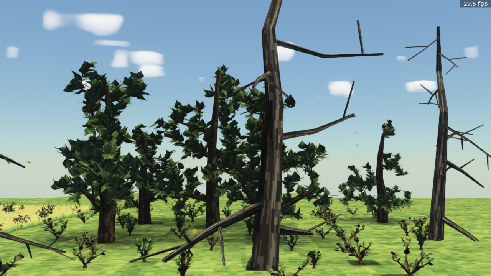

# The FireEngine Progression

**Eight days. One human directing. AI coding agents doing the engineering.**

Between **June 9 and June 16, 2026**, this repository went from an empty folder to a custom
voxel game engine with GPU global illumination, a physically-based sky, volumetric weather,
a living wind field, procedurally grown forests, and a Unity-style editor — roughly 130
commits, **236 test files (~4,700 passing tests)**, 43 per-package system docs, and **350+
development screenshots committed along the way**.

This folder is the visual record. Every screenshot below was captured *during* development —
most of them by the AI agents themselves, using the engine's own headless screenshot tools to
check their work. They are unretouched (fps counters and all), and they are the same images
the agents looked at before deciding what to fix next.

*Day 8: a fully procedural forest. Every trunk, branch, leaf, bush, flower, cloud, and blade of
grass is generated from a single world seed — there are no hand-made art assets in this scene.*

## The arc

| Days | Dates | What shipped | Chapter |
|---|---|---|---|
| Day 1 | June 9 | Deterministic voxel world, explosion craters, delta saves, first procedural sky & weather | [Part 1 — Foundations](01-foundations.md) |
| Days 2–5 | June 10–13 | GPU radiance-cascade lighting, ray-marched global illumination, HDR pipeline, physical sky | [Part 2 — Light and Sky](02-light-and-sky.md) |
| Days 3–5 | June 11–13 | Instanced grass, wind field, flora, procedurally grown 3-D trees, spatial storms, buildings | [Part 3 — A Living World](03-a-living-world.md) |
| Days 5–8 | June 13–16 | Fire Editor, frame profiler, machine-enforced standards gate, tree iterations 2→4 | [Part 4 — Iteration at Machine Speed](04-iteration-at-machine-speed.md) |

## How it was built

The workflow that made this pace possible is visible throughout the repo:

- **Docs as the AI search index.** Every package has a system doc in
  [`docs/systems/`](../systems/) with identical headings, so agents grep documentation before
  reading code. Stale docs fail the build.
- **Headless everything.** Only the render bridge may import the rendering SDK; the entire
  simulation runs and is tested without a GPU. Agents verified visuals with offscreen
  screenshot tools (`tools/screenshot.py`, `tools/preview_texture.py`) — which is why this
  progression record exists at all.
- **Determinism as a contract.** The whole world is a pure function of one seed. Same seed,
  same world, byte for byte — which makes delta saves tiny and every bug reproducible.
- **A machine-enforced standards gate.** Structure limits, lint, types, docs links, and
  per-module test presence all fail the build like a broken test
  ([`docs/systems/standards.md`](../systems/standards.md)). It is built to survive many AI
  agents working in parallel.
- **Session handoffs.** Each working session ended with a handoff note in
  [`docs/sessions/`](../sessions/) and a dated entry in [`DECISIONS.md`](../../DECISIONS.md),
  so the next agent started with full context.

Start with [Part 1 — Foundations](01-foundations.md).
